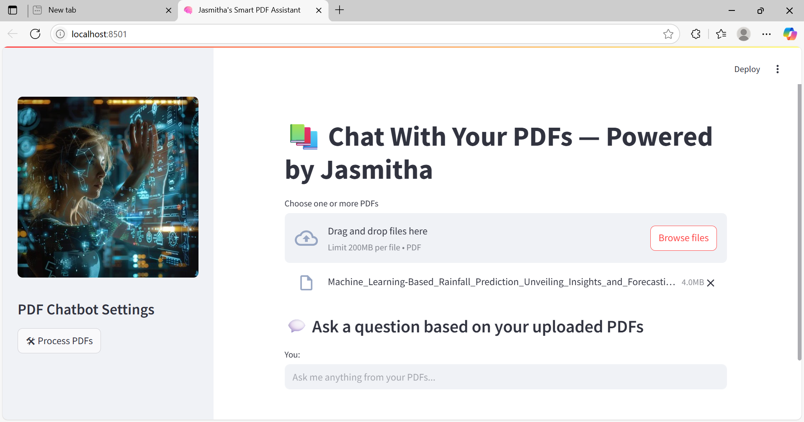
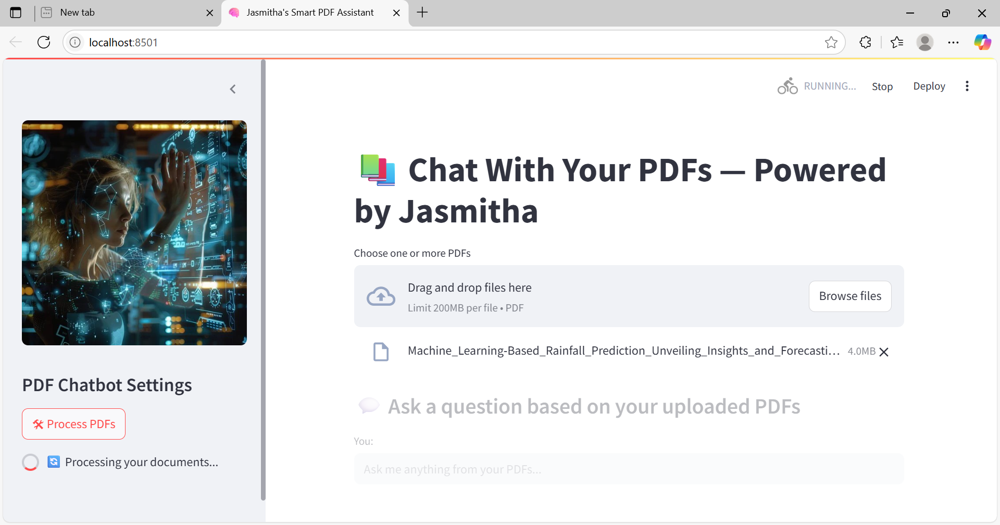
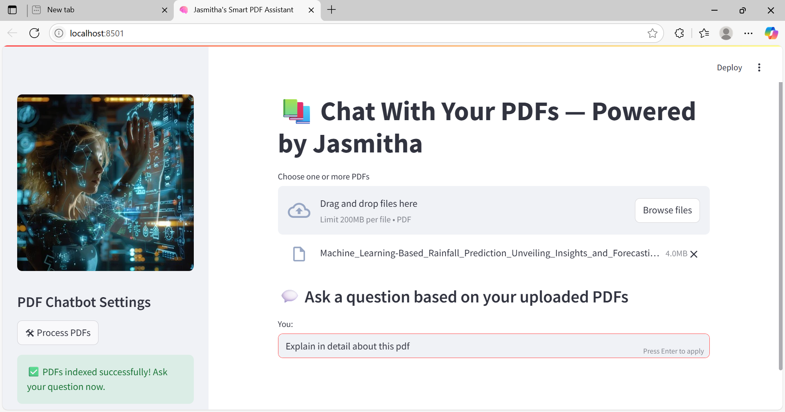
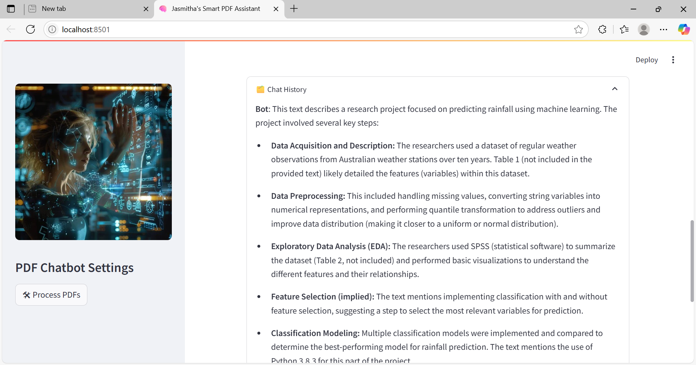

# 📚 Jasmitha's Smart PDF Assistant 🧠

An intelligent chatbot that lets you interact with multiple PDFs using natural language — powered by **Gemini**, **LangChain**, and **Streamlit**.

---

## 🚀 Overview

This app allows users to upload one or more PDF documents and ask questions about their content. It uses Google Generative AI (Gemini) to generate embeddings and conversational responses, with LangChain handling retrieval and memory. The interface is built with Streamlit for a smooth user experience.

---

## 🧠 Architecture


### 🔄 Workflow

1. **PDF Loading**: Extracts text from uploaded PDFs using PyPDF2.
2. **Text Chunking**: Splits text into manageable chunks for embedding.
3. **Embeddings**: Uses Gemini's embedding model via LangChain.
4. **Vector Indexing**: Stores chunks in a FAISS vector database.
5. **Conversational QA**: Uses Gemini Pro to answer questions based on document content.

---

## ✨ Features

- 📁 **Multi-PDF Support**: Upload and query multiple PDFs at once.
- 🤖 **Gemini Integration**: Embeddings and chat powered by Google Generative AI.
- 🧩 **LangChain Retrieval**: Efficient chunking and memory handling.
- 🖼️ **Streamlit UI**: Clean interface with sidebar controls and image support.
- 📥 **Answer Download**: Save chatbot responses as `.txt` files.
- 💬 **Chat History**: Expandable panel to view past interactions.

---

## 🛠️ Installation & Setup

### 🔧 Requirements

Install dependencies:

```bash
pip install -r requirements.txt

🔐 API & Credentials
- Google API Key
Create a .env file in the root directory:
GOOGLE_API_KEY=<your-api-key-here>
- Service Credentials
Place your google_service_key.json inside the credentials/ folder.

▶️ Running the App
streamlit run chatapp.py


💡 Usage
- Upload one or more PDFs using the sidebar.
- Click Process PDFs to index the documents.
- Ask questions in natural language.
- View and download responses.
- Expand the Chat History panel to review past interactions.

🖼️ Demo Screenshots
### 📤 Uploading PDFs


### 🔄 Processing PDFs


### 🧩 Parsing PDFs


### ❓ Asking Questions


### 🤖 Bot Responses


### 💬 Chat History

