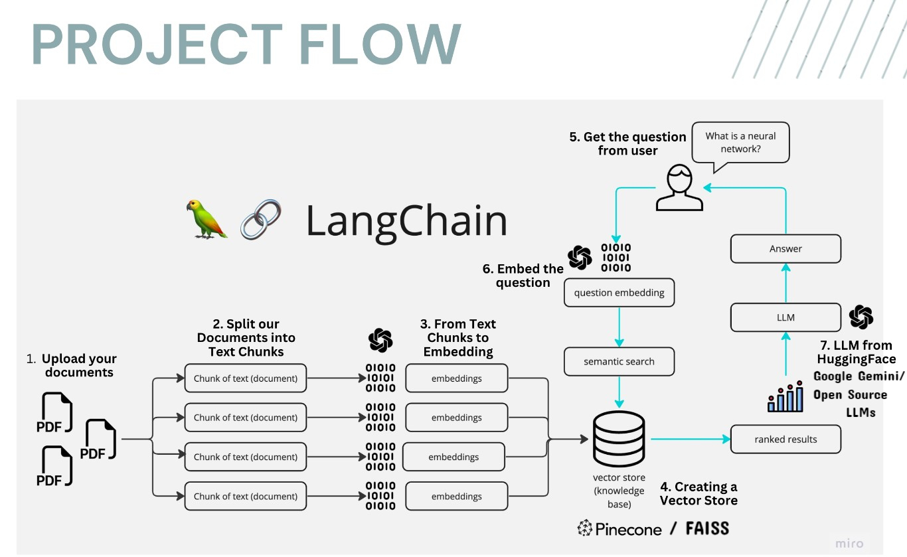
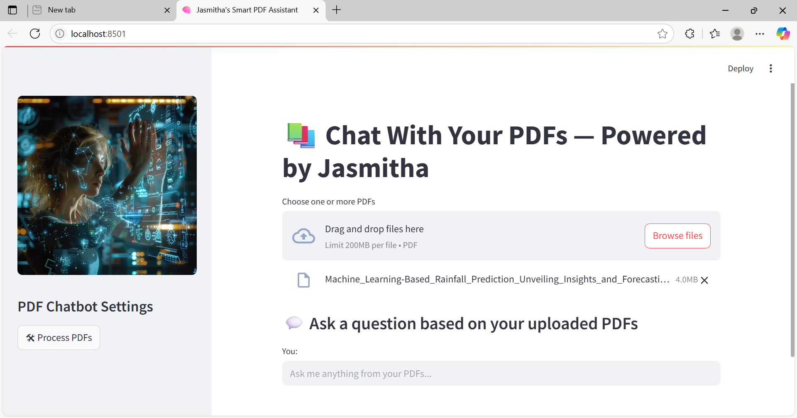
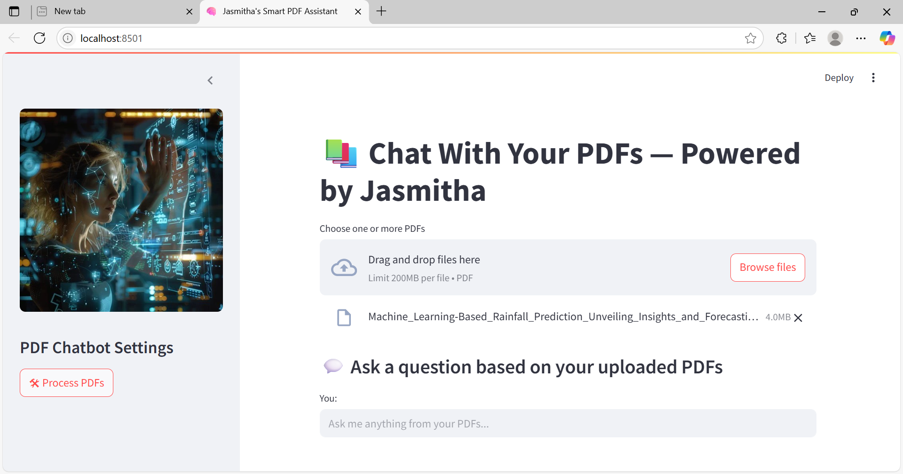
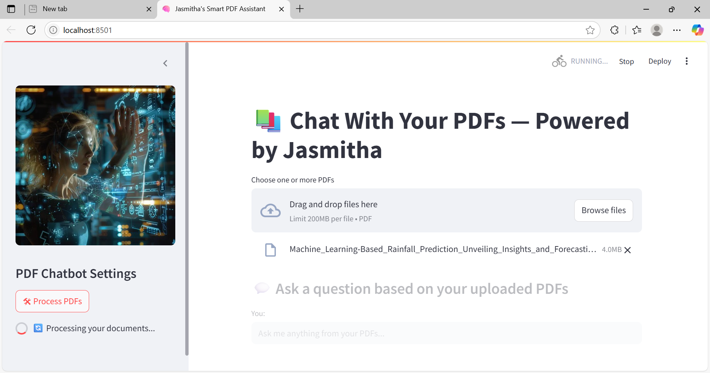
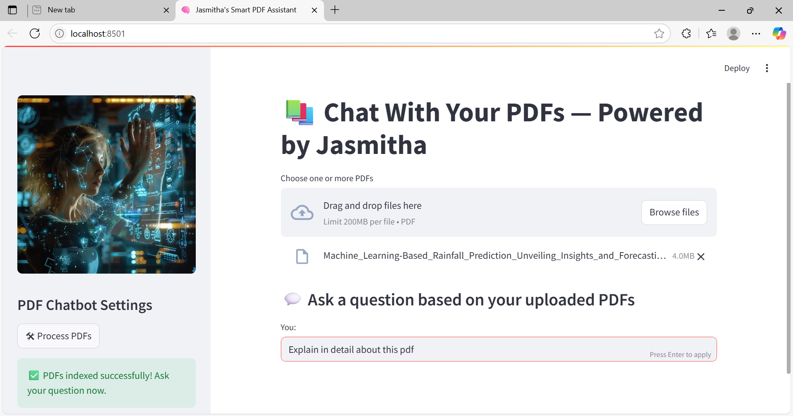
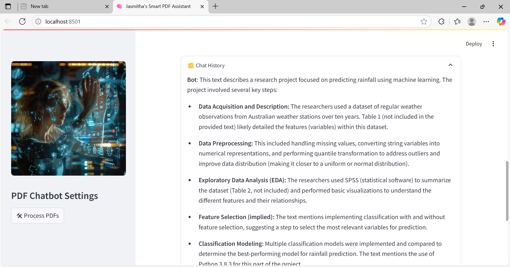

# 📚 Jasmitha's Smart PDF Assistant 🧠

An intelligent chatbot that lets you interact with multiple PDFs using natural language — powered by Gemini, LangChain, and Streamlit.

---

## 🎯 How It Works



1. **PDF Loading**: Extracts text from one or more uploaded PDFs.
2. **Text Chunking**: Splits text into manageable chunks using recursive character splitting.
3. **Embeddings**: Generates vector embeddings using Gemini's embedding model.
4. **Vector Indexing**: Stores chunks in a FAISS vector database for fast retrieval.
5. **Conversational QA**: Uses Gemini Pro via LangChain to answer user questions based on document content.

---

## ✨ Key Features

- 🔍 **Multi-PDF Support**: Upload and query multiple PDFs simultaneously.
- 🧠 **Gemini Integration**: Uses Google Generative AI for embeddings and chat responses.
- 🧩 **LangChain-Powered Retrieval**: Efficient chunking, memory, and conversational flow.
- 🖼️ **Streamlit UI**: Clean, responsive interface with sidebar controls and image support.
- 📥 **Answer Download**: Save chatbot responses as `.txt` files.
- 🗂️ **Chat History**: View past interactions in an expandable panel.

---

## 🛠️ Requirements

- `streamlit`
- `google-generativeai`
- `langchain`
- `langchain_google_genai`
- `PyPDF2`
- `faiss-cpu`
- `python-dotenv`

Install dependencies:

```bash
pip install -r requirements.txt

Installation & Setup
- Clone the repo
git clone https://github.com/Jashh213/Pdf-chat-app.git
cd Pdf-chat-app

- Set up your Google API key
Create a .env file in the root directory:
GOOGLE_API_KEY=<your-api-key-here>
- Add your service credentials
Place your google_service_key.json inside the credentials/ folder.
- Run the app
streamlit run chatapp.py


💡 Usage
- Upload one or more PDFs using the sidebar.
- Click Process PDFs to index the documents.
- Ask questions in natural language.
- View responses and download them as .txt files.
- Expand the Chat History panel to review past interactions.

🌱 Credits & License
This project is inspired by the MIT-licensed work of Gurpreet Kaur Jethra.
I have built my own version with significant enhancements, including:
- Gemini API integration via Vertex AI
- Custom PDF parsing and error handling
- Streamlit UI redesign
- Secure credential management
- Downloadable responses and chat history
Distributed under the MIT License.

## 🖼 Demo Output

### 📤 PDF Upload Interface
## 📄 Demo Output

## 📸 Demo Screenshots

### 📤 PDF Upload Interface


### 🔄 Processing PDF


### 🧩 Parsing PDF


### ❓ Bot Asking Question


### 🤖 Bot Giving Response


### 💬 Final Chat Response

